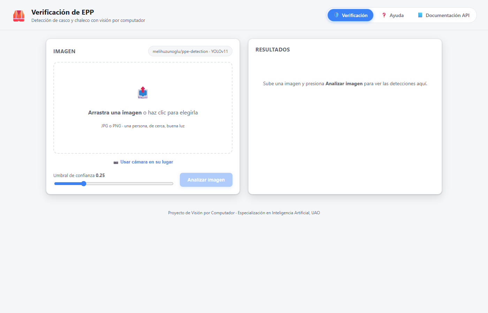
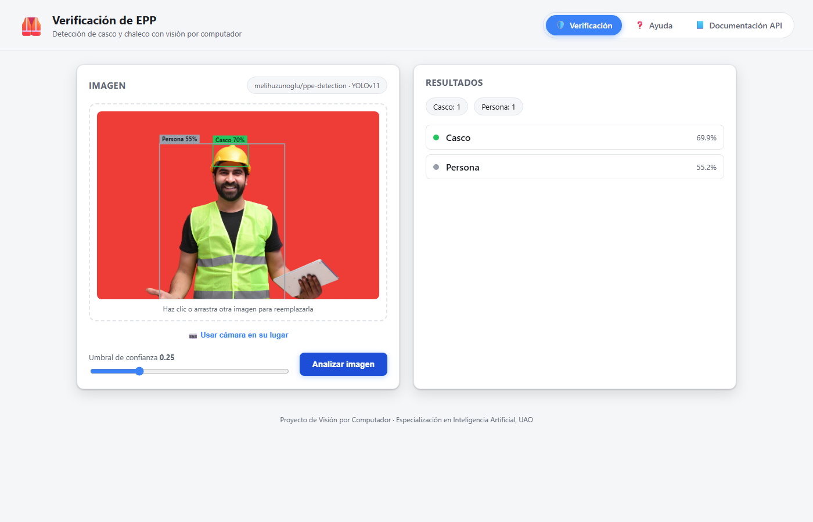

# ppe-detection-verificacion


Sistema de verificación automática de EPP (casco y chaleco) en entornos
industriales mediante visión por computador, usando el modelo preentrenado
YOLOv11 [`melihuzunoglu/ppe-detection`](https://huggingface.co/melihuzunoglu/ppe-detection).

## Tabla de contenidos

- [Vista previa](#vista-previa)
- [Stack tecnológico](#stack-tecnológico)
- [Arquitectura](#arquitectura)
- [Cómo levantar el proyecto](#cómo-levantar-el-proyecto)
- [Endpoints REST](#endpoints-rest)
- [Descarga del modelo](#descarga-del-modelo)
- [Captura por cámara](#captura-por-cámara)
- [Pruebas unitarias](#pruebas-unitarias)
- [Deploy](#deploy)
- [Herramientas de desarrollo con IA](#herramientas-de-desarrollo-con-ia)
- [Documentación adicional](#documentación-adicional)
- [Licencia](#licencia)

## Vista previa

| Pantalla principal | Resultado de detección |
|---|---|
|  |  |

## Stack tecnológico

| Componente | Tecnología |
|---|---|
| API / backend | [FastAPI](https://fastapi.tiangolo.com/) + Uvicorn |
| Modelo de detección | YOLOv11 (`melihuzunoglu/ppe-detection`) vía [Ultralytics](https://docs.ultralytics.com/) |
| Descarga de pesos | [Hugging Face Hub](https://huggingface.co/docs/huggingface_hub) |
| Interfaz web | Jinja2 + CSS/JS propios (sin Gradio/Streamlit) |
| Imágenes | Pillow |
| Gestión de dependencias | [uv](https://docs.astral.sh/uv/) |
| Contenedor / deploy | Docker + Render |
| Pruebas | pytest + pytest-cov |
| Lint / tipos | ruff + mypy |

## Arquitectura

Arquitectura hexagonal (puertos y adaptadores):

- `domain/` — entidades y reglas de negocio (sin dependencias externas),
  incluyendo `Detection`, las entidades de cumplimiento y la evaluación de
  casco/chaleco por persona.
- `application/` — casos de uso (`DetectPPEUseCase`) y puertos
  (`inbound`/`outbound`).
- `infrastructure/adapters/inbound/` — adaptadores de entrada:
  - `api/` — endpoints REST (FastAPI), ej. `POST /detect`.
  - `web/` — interfaz web (Jinja2 + CSS/JS propios, sin Gradio/Streamlit),
    servida por el mismo FastAPI en `/app`.
- `infrastructure/adapters/outbound/model/` — adaptadores de salida:
  `HuggingFaceModelProvider` (descarga los pesos) y `YoloDetector` (ejecuta
  la inferencia).

### Flujo de verificación

El flujo actual es:

```text
imagen → detección YOLO → detecciones → evaluación de cumplimiento → respuesta API → panel
```

El backend es la única fuente de verdad para el cumplimiento. El panel
presenta los estados y valores recibidos de la API, sin recalcular las reglas.

El estado global de `summary.status` puede ser:

- `COMPLIANT` — todas las personas detectadas cumplen con casco y chaleco.
- `NON_COMPLIANT` — al menos una persona detectada no cumple.
- `NO_PERSONS` — no se detectaron personas.

Cada elemento de `persons` también incluye su estado individual (`COMPLIANT` o
`NON_COMPLIANT`), además de indicar si tiene casco y chaleco.

## Cómo levantar el proyecto

Este proyecto se gestiona con [uv](https://docs.astral.sh/uv/). La versión de Python
queda fijada en `.python-version` y las dependencias resueltas en `uv.lock`.

```bash
uv sync
uv run uvicorn ppe_detection.main:app --reload --app-dir src
```

`uv sync` crea el entorno virtual (`.venv`) e instala el proyecto junto con sus
dependencias a partir de `pyproject.toml` / `uv.lock`.

Atajo con `make` (equivale al `uv run uvicorn ...` de arriba):

```bash
make r
```

Luego abre **http://127.0.0.1:8000/app** — interfaz web para subir una imagen
(o tomar una foto con la cámara del PC/celular) y ver las detecciones
dibujadas sobre ella. Incluye menú con:

- **Verificación** (`/app`) — la pantalla principal.
- **Ayuda** (`/help`) — qué detecta el modelo, cómo funciona el umbral de
  confianza, consejos para buenas fotos y limitaciones conocidas.
- **Documentación API** (`/docs`) — Swagger autogenerado por FastAPI.

`/` redirige automáticamente a `/app`. `/health` sigue disponible para checks
de salud del servicio.

<details>
<summary>Alternativa con pip + venv</summary>

```bash
python -m venv .venv
.venv\Scripts\activate        # Windows
pip install -e .
uvicorn ppe_detection.main:app --reload --app-dir src
```

</details>

## Endpoints REST

- `POST /detect?confidence=0.25` — recibe una imagen (`multipart/form-data`,
  campo `file`) y devuelve las detecciones crudas junto con la evaluación de
  cumplimiento. La respuesta contiene `detections`, `persons` y `summary`.
- `GET /health` — healthcheck.

Ejemplo breve de respuesta de `POST /detect`:

```json
{
  "detections": [
    {
      "class_name": "human",
      "confidence": 0.88,
      "bbox": [100.0, 20.0, 200.0, 300.0]
    }
  ],
  "persons": [
    {
      "id": 1,
      "status": "COMPLIANT",
      "helmet": true,
      "vest": true,
      "confidence": 0.88,
      "bbox": [100.0, 20.0, 200.0, 300.0]
    }
  ],
  "summary": {
    "total_persons": 1,
    "compliant": 1,
    "non_compliant": 0,
    "status": "COMPLIANT"
  }
}
```

## Descarga del modelo

Los pesos del modelo `melihuzunoglu/ppe-detection` (YOLOv11) se descargan desde
Hugging Face Hub mediante `hf_hub_download`, a través del adaptador
`HuggingFaceModelProvider`
(`src/ppe_detection/infrastructure/adapters/outbound/model/huggingface_model_provider.py`).

```bash
make download-model
```

El archivo `best.pt` queda cacheado en `~/.cache/huggingface/hub/` (no se
vuelve a descargar en ejecuciones posteriores). No requiere autenticación al
ser un repositorio público, aunque configurar `HF_TOKEN` evita límites de
tasa más estrictos.

## Captura por cámara

La interfaz web permite tomar la foto directo desde la cámara (PC o celular)
usando `getUserMedia`, sin subir ningún archivo previo. Funciona sin HTTPS
mientras se accede por `localhost`/`127.0.0.1`, porque los navegadores tratan
esas direcciones como contexto seguro. **En producción (Docker, servidor
remoto) la cámara solo funcionará si el sitio se sirve por HTTPS.**

## Pruebas unitarias

El proyecto cuenta con 50 pruebas unitarias, con 100% de cobertura de línea
sobre `src/ppe_detection`.

### Cómo ejecutarlas

```bash
uv sync
uv run pytest tests/unit -v
```

Con reporte de cobertura:
```bash
uv run pytest tests/unit --cov=src/ppe_detection --cov-report=term-missing
```

### Qué se prueba

| Módulo | Descripción |
|---|---|
| `domain/entities/compliance.py` | Estados `COMPLIANT`, `NON_COMPLIANT` y `NO_PERSONS`, además de las propiedades de las entidades de cumplimiento |
| `domain/services/compliance_service.py` | Regla de negocio: cruce de personas con casco/chaleco, incluyendo casos de una y de varias personas en la misma imagen con estados mixtos |
| `application/use_cases/detect_ppe.py` | Caso de uso `DetectPPEUseCase`: detección y evaluación de cumplimiento, aislado de HTTP y del modelo real |
| `application/use_cases/detection_result.py` | Resultado de aplicación que agrupa las detecciones y el reporte de cumplimiento |
| `infrastructure/adapters/outbound/model/yolo_detector.py` | Adaptador YOLO: mapeo de resultados del modelo a entidades `Detection`, carga perezosa del modelo (una sola vez), umbral de confianza |
| `infrastructure/adapters/outbound/model/huggingface_model_provider.py` | Descarga de pesos desde Hugging Face Hub (mockeada, sin red real) |
| `infrastructure/config/dependencies.py` | Composition root: verifica el wiring correcto de adaptadores y el cacheo como singleton |
| `infrastructure/adapters/inbound/api/routers/detection_router.py` | Endpoint `POST /detect`: detecciones, cumplimiento, contrato de respuesta, umbral de confianza y ejecución no bloqueante |
| `infrastructure/adapters/inbound/api/routers/health_router.py` | Endpoint `GET /health` |
| `infrastructure/adapters/inbound/web/web_router.py` | Rutas de la interfaz web (`/`, `/app`, `/help`): redirecciones y respuestas HTML |
| `infrastructure/adapters/inbound/api/schemas/detection_schema.py` | Schemas Pydantic para detecciones, personas evaluadas y resumen de cumplimiento |

### Enfoque

Las pruebas unitarias de infraestructura (YOLO, Hugging Face y endpoints) usan
`unittest.mock` para aislar por completo el modelo real y la red — ninguna
prueba unitaria descarga pesos ni ejecuta inferencia real. Las pruebas de
integración del modelo real se ejecutan por separado y requieren los pesos y
la red.

## Deploy

El proyecto incluye lo necesario para desplegarse como contenedor.

### Docker

```bash
make docker-build
docker run -p 8000:8000 ppe-detection-verificacion
```

El `Dockerfile` construye la imagen e instala dependencias con `uv`; `.dockerignore`
excluye archivos de desarrollo local (entorno virtual, caché, specs, etc.).

### Render

`render.yaml` define un servicio web basado en el mismo `Dockerfile`
(`runtime: docker`), con healthcheck en `/health`. Al conectar el repositorio
en [Render](https://render.com/), el servicio se configura automáticamente a
partir de ese archivo.

> **Nota:** la captura por cámara (ver [sección anterior](#captura-por-cámara))
> solo funciona en producción si el sitio se sirve por HTTPS — Render lo
> provee por defecto en sus dominios `.onrender.com`.

## Herramientas de desarrollo con IA

El proyecto usa ayudas de desarrollo asistido con IA (Spec Kit y agent
skills), opcionales para ejecutar la aplicación. Ver
[`docs/desarrollo-ia.md`](docs/desarrollo-ia.md) para instrucciones de
instalación y uso.

## Documentación adicional

- [`docs/pruebas_inferencia_umbrales.md`](docs/pruebas_inferencia_umbrales.md) —
  pruebas iniciales de inferencia, ajuste de umbral de confianza, y hallazgo
  sobre las limitaciones del modelo con fotos de estudio/banco de imágenes.
<<<<<<< HEAD

## Licencia

Este proyecto se distribuye bajo la licencia [MIT](LICENSE).
=======
>>>>>>> main
